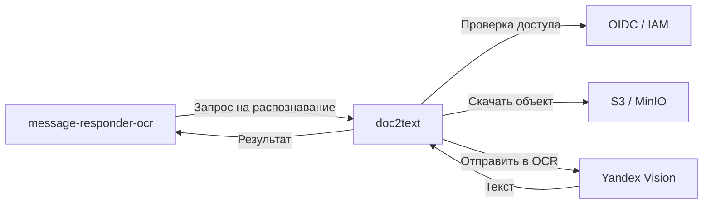
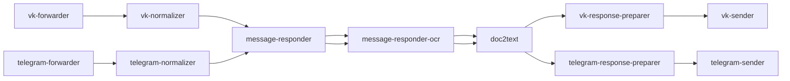

## О приложении

doc2text — gRPC‑сервис, который принимает ключ объекта в S3/MinIO, скачивает файл, конвертирует его в Base64 и отправляет байты в Yandex Vision OCR. Ответ Vision распаковывается в чистый текст и возвращается вызывающей стороне; параллельно сервис публикует метрики и health‑эндпоинт по HTTP.

## Роль приложения в архитектуре проекта

doc2text — центральный распознаватель текста в обеих цепочках:


Сервис изолирует работу с S3 и Yandex Cloud: остальные компоненты передают только ключ объекта, а doc2text отвечает за скачивание, конвертацию и авторизацию в OCR (IAM токен или API key). Опционально gRPC защищается OIDC‑интерцептором, чтобы принимать запросы только от доверенных клиентов.

## Локальный запуск

1. Поставьте Go ≥ 1.24, поднимите локальное S3‑совместимое хранилище (MinIO) и получите доступ к Yandex Cloud Vision (IAM‑токен или API‑ключ). Для health‑чеков достаточно HTTP‑порта `:8090`.
2. Экспортируйте переменные окружения:
   - gRPC/HTTP: `G_RPC_SERVER_DOC2TEXT_ADDR` (по умолчанию `:8080`), `HTTP_SERVER_DOC2TEXT_ADDR` (по умолчанию `:8090`).
   - S3: `S3_ENDPOINT`, `S3_ACCESS_KEY`, `S3_SECRET_KEY`, `S3_BUCKET`, `S3_USE_SSL=false|true`.
   - Yandex OCR: один из вариантов авторизации `YC_API_KEY` **или** `YC_IAM_TOKEN`, а также `YC_FOLDER_ID`, `YC_ENDPOINT` (обычно `https://vision.api.cloud.yandex.net/vision/v1/batchAnalyze`), `YC_DEFAULT_MODEL`, `YC_LANGUAGES` (через запятую), `YC_MIN_CONFIDENCE`, `YC_HTTP_TIMEOUT`.
   - Опционально защита gRPC: `OIDC_DOC2TEXT_ISSUER`, `OIDC_DOC2TEXT_JWKS_URL`, `OIDC_DOC2TEXT_AUDIENCE`, `OIDC_DOC2TEXT_EXPECTED_AZP`.
3. Запустите сервис:
   ```bash
   go run ./cmd/doc2text
   ```
   или соберите контейнер `docker build -t doc2text .` и передайте те же переменные в `docker run`.
4. Проверьте работоспособность запросом `GET http://localhost:8090/healthz` и gRPC‑вызовом `ocr.v1.OcrService/Process`.
