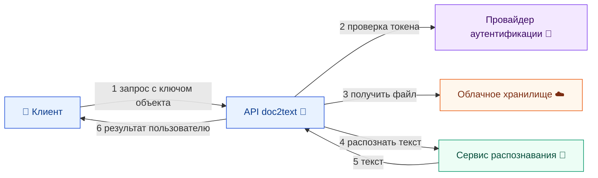

# doc2text 🧠

Сервис распознаёт текст из файлов (OCR) и отдаёт результат по gRPC: objectKey → скачивание из S3 → конвертация в Base64 → запрос в Yandex OCR → текст.

- [Системный дизайн](docs/system-design/README.md)
- [Использование и запуск](docs/usage/README.md)

